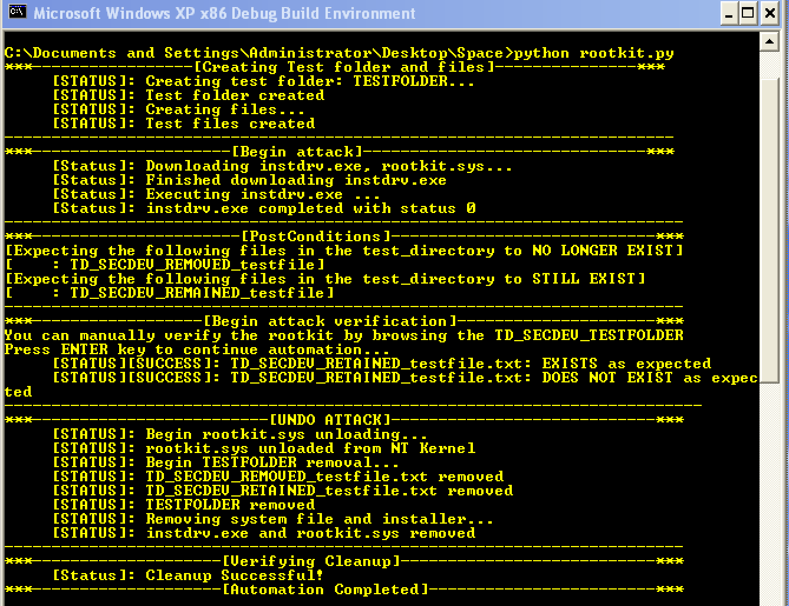

# TD Security Developer Challenge Solution
## Candidate Name: Udonsi Kelechukwu
---
## Technique leveraged: Rootkits
## Technique Details (MITRE ATT&CK):

```
Rootkits are programs that hide the existence of malware by intercepting (i.e., Hooking) and 
modifying operating system API calls that supply system information. Rootkits or rootkit enabling 
functionality may reside at the user or kernel level in the operating system or lower, to include a 
Hypervisor, Master Boot Record, or the System Firmware. Adversaries may use rootkits to hide the 
presence of programs, files, network connections, services, drivers, and other system components. 
Rootkits have been seen for Windows, Linux, and Mac OS X systems.

```
The solution contains the following files

| File | Description |
|------|-------------|
| [MAKEFILE](MAKEFILE) | Driver build Makefile |
| [SOURCES](SOURCES) | Specifies input and output files used to build driver |
| [rootkit.c](rootkit.c) | rootkit source code |
| [rootkit.py](rootkit.py) | Automates download, installation, testing, removal of rootkit |
| [INSTDRV.EXE](INSTDRV.EXE) | Third party driver installation tool |
| [rootkit.sys](rootkit.sys) | Custom simple rootkit |

# Script Usage:

+   ## **Pre-Conditions**

    The following pre-conditions are required for successful use of this rootkit attack automation:

    | Condition | Value |
    |-----------|-------|
    | Operating System | Windows XP Professional SP2 and SP3 |
    | Software | [Python 3.4](https://www.python.org/ftp/python/3.4.3/python-3.4.3.msi)|
    | Software Module | `requests`: `python -m pip install requests`|
    | Permissions |  Script is running as Administrator |

The script creates a `TESTFOLDER` directory, creates some files within this directory and then installs a rootkit capable of hiding files prefixed with `TD_SECDEV_REMOVED`. This scenario simulates a virus with a rootkit component installed to hide it's activities such as created or configuration files.

+   ## **Post-Conditions**

    There are initially two files within the `TESTFOLDER` directory namely `TD_SECDEV_REMOVED_testfile.txt` and `TD_SECDEV_RETAINED_testfile.txt`.

    **Before** the installation of the rootkit:
    ```
    C:\Documents and Settings\Administrator\Desktop\Space>dir TESTFOLDER
    Volume in drive C has no label.
    Volume Serial Number is B040-5387

    Directory of C:\Documents and Settings\Administrator\Desktop\Space\TESTFOLDER

    03/17/2018  10:05 AM    <DIR>          .
    03/17/2018  10:05 AM    <DIR>          ..
    03/17/2018  10:05 AM               171 TD_SECDEV_REMOVED_testfile.txt
    03/17/2018  10:05 AM               171 TD_SECDEV_RETAINED_testfile.txt
                2 File(s)            342 bytes
                2 Dir(s)  29,495,775,232 bytes free

    C:\Documents and Settings\Administrator\Desktop\Space>

    ```

    **After** the installation of the rootkit:
    ```
    C:\Documents and Settings\Administrator\Desktop\Space>dir TESTFOLDER
    Volume in drive C has no label.
    Volume Serial Number is B040-5387

    Directory of C:\Documents and Settings\Administrator\Desktop\Space\TESTFOLDER

    03/17/2018  10:02 AM    <DIR>          .
    03/17/2018  10:02 AM    <DIR>          ..
    03/17/2018  10:02 AM               171 TD_SECDEV_RETAINED_testfile.txt
                1 File(s)            171 bytes
                2 Dir(s)  29,495,738,368 bytes free

    C:\Documents and Settings\Administrator\Desktop\Space>
    ```

    The script automates gives the user a chance to verify the content of the `TESTFOLDER` manually before automating the validation

+   ## Usage

    ```
    C:\Documents and Settings\Administrator\Desktop\Space>python rootkit.py -h
    usage: rootkit.py [-h] [-l] [-c]

    optional arguments:
    -h, --help        show this help message and exit
    -l, --local       Use these options if instdrv.exe and rootkit.sys need not
                        be downloaded
    -c, --conditions  Show Pre/Post conditions and exit

    C:\Documents and Settings\Administrator\Desktop\Space>
    ```

+   ## Technical Details

    +   ### Behaviour

        The scripts downloads a publicly hosted copy of the [rootkit.sys](rootkit.sys) and [INSTDRV.EXE](INSTDRV.EXE). These links will expire in 14 days. However, they have been included in the submission and can be downloaded manually and used by the script by specify the `-l` option. See **Usage**

        [rootkit.sys](rootkit.sys) is a custom simple rootkit I have developed to hijack the `ZwQueryDirectoryFile`. This is the system call responsible for returning file and directory information. Only file and directory listings queries have been hijacked for the system call. The new system call basically calls the original system call for any functionality that was not hijacked. The files being hidden by this rootkit must be prefixed by the string `TD_SECDEV_REMOVED`. In a real scenario, standalone rootkit or virus accompanying rootkit will utilize device objects. These device objects will allow the user space malware to dynamically specify the files or processes or networks etc that should be hidden by the rootkit for persistence.

        [INSTDRV.EXE](INSTDRV.EXE) is a third-party tool for installing drivers. Original copy on [github](https://github.com/fdiskyou/www.rootkit.com/tree/master/subverting_the_windows_kernel/InstDvr). It's license permits usage and redistribution.

        The script sets up a test folder named `TESTFOLDER`. It then creates two files. One with the target prefix and the other with a different prefix. It then executes `INSTDRV.EXE` with the `rootkit.sys` as parameter, effectively installing the rootkit. The script then attempts to list the content of the `TESTFOLDER` directory and confirms that the filename with the target prefix is not listed.

        The script cleans up by unloading the driver from the kernel, deleting `TESTFOLDER` and all the files created within. Deleting the `rootkit.sys` and `INSTDRV.EXE` files.

        The script also verifies the cleanup by verifying the paths to the files used by the automation no longer exist.

    +   ### Error Handling

        Error Handling such as Exceptions have been excluded for simplicity. However, a production automation tool must correctly handle Exceptions to ensure reliability.

    
    +   ### Compatibility

        The pre-conditions are hard requirements. However, the script can be ported to more current versions of python easily. More so, the rootkit is not robust and may fail against sophisticated defence tools like the Windows Defender. The target for this automation and leverage attack is Windows XP Professional SP2 and SP3

+   ## Additional Details

    The script has a verbose output detailing the attack steps. A sample output can be seen below

    

